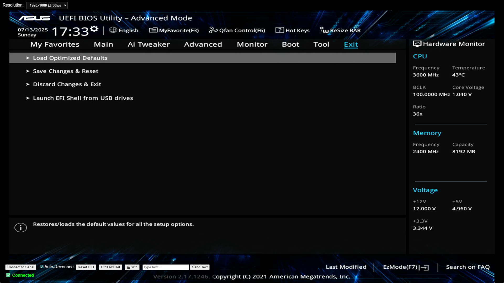

# USB Web KVM

A DIY USB web KVM.

I had these parts lying around and decided to make a USB KVM instead of buying one.

## Parts list

- Raspberry PI Pico
- USB to Serial (UART)
  - I used a FT232R device as Windows has drivers for it
- Cheap HDMI to USB Capture device
  - I used a MS2109-based device
- USB Y splitter

## Wiring

Connect the USB serial adapter to the Pico

- Adapter TX -> Pico GP0
- Adapter RX -> Pico GP1
- Adapter GND -> Pico GND

## Raspberry PI Pico Firmware Setup

### Flash Circuit Python to the Pico

1. Download the `.uf2` file for the Pico from https://circuitpython.org/board/raspberry_pi_pico/
2. Hold `BOOTSEL` and plug the Pico into your computer
3. Copy the `.uf2` file ot the Pico drive

#### Install HID Library

1. Download the Circuit Python libraries from https://circuitpython.org/libraries
2. Extract and copy `lib/adafruit_hid` to the Pico's `lib/` directory

### Installing Pico Code

1. Download and copy `code.py` to the Pico in the root directory

## Connecting

Connect the HDMI and Pico USB to a target PC. Connect the single USB Y splitter to your local PC. Open `index.html` in a Chromium browser and connect.
